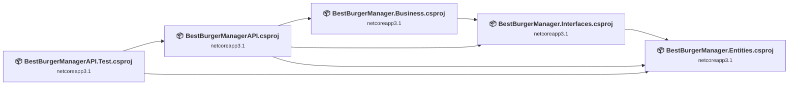
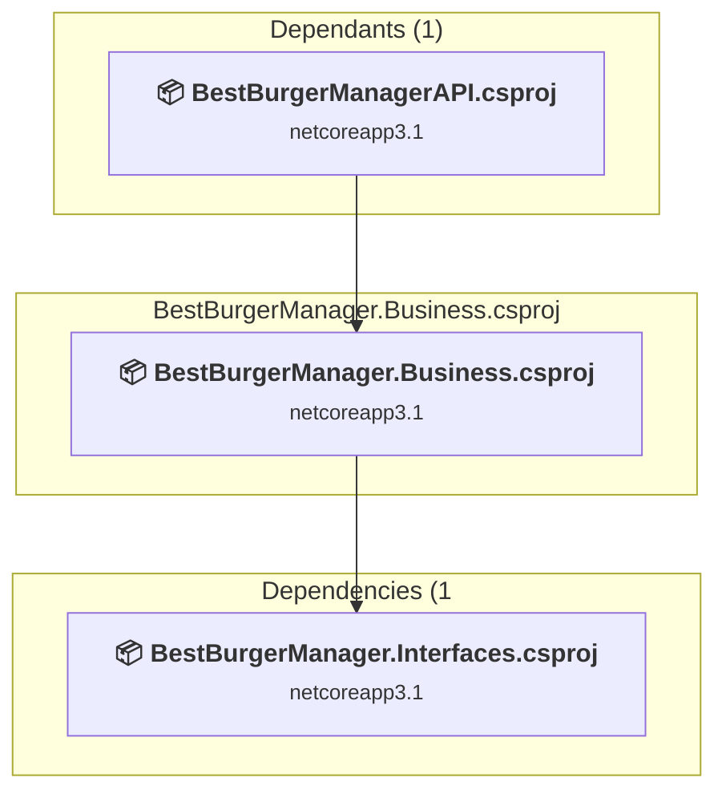
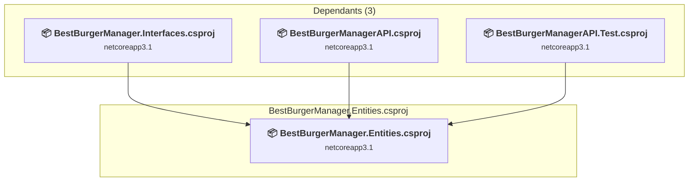
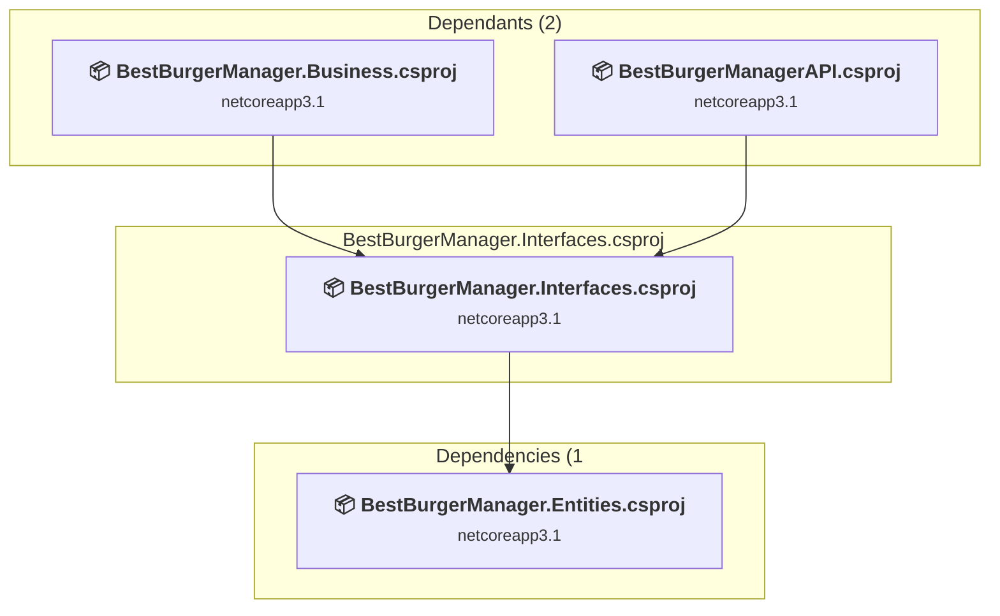
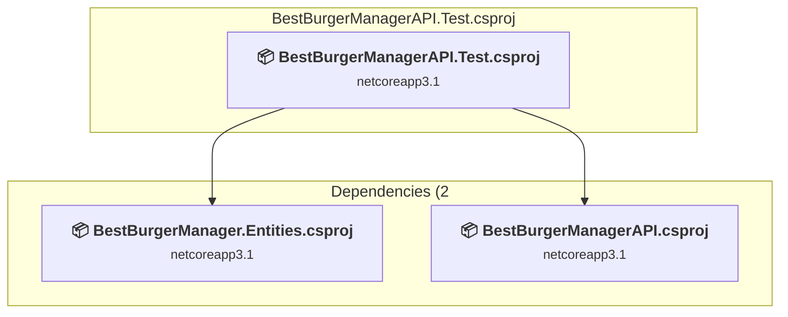
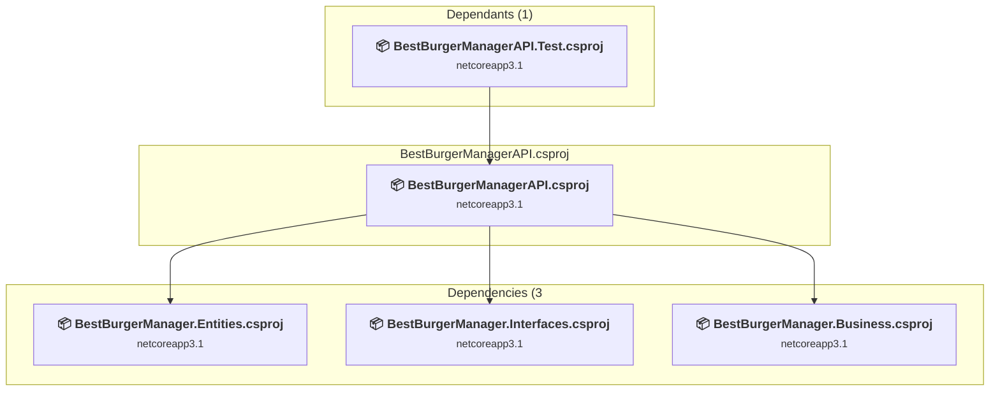

# Projects and dependencies analysis

This document provides a comprehensive overview of the projects and their dependencies in the context of upgrading to .NETCoreApp,Version=v9.0.

## Table of Contents

- [Executive Summary](#executive-Summary)
  - [Highlevel Metrics](#highlevel-metrics)
  - [Projects Compatibility](#projects-compatibility)
  - [Package Compatibility](#package-compatibility)
  - [API Compatibility](#api-compatibility)
  - [Binding Redirect Configuration](#binding-redirect-configuration)
- [Aggregate NuGet packages details](#aggregate-nuget-packages-details)
- [Top API Migration Challenges](#top-api-migration-challenges)
  - [Technologies and Features](#technologies-and-features)
  - [Most Frequent API Issues](#most-frequent-api-issues)
- [Projects Relationship Graph](#projects-relationship-graph)
- [Project Details](#project-details)

  - [BestBurgerManager.Business\BestBurgerManager.Business.csproj](#bestburgermanagerbusinessbestburgermanagerbusinesscsproj)
  - [BestBurgerManager.Entities\BestBurgerManager.Entities.csproj](#bestburgermanagerentitiesbestburgermanagerentitiescsproj)
  - [BestBurgerManager.Interfaces\BestBurgerManager.Interfaces.csproj](#bestburgermanagerinterfacesbestburgermanagerinterfacescsproj)
  - [BestBurgerManagerAPI.Test\BestBurgerManagerAPI.Test.csproj](#bestburgermanagerapitestbestburgermanagerapitestcsproj)
  - [BestBurgerManagerAPI\BestBurgerManagerAPI.csproj](#bestburgermanagerapibestburgermanagerapicsproj)

## Executive Summary

### Highlevel Metrics

| Metric | Count | Status |
| :--- | :---: | :--- |
| Total Projects | 5 | All require upgrade |
| Total NuGet Packages | 12 | 3 need upgrade |
| Total Code Files | 41 |  |
| Total Code Files with Incidents | 14 |  |
| Total Lines of Code | 2833 |  |
| Total Number of Issues | 31 |  |
| Estimated LOC to modify | 20+ | at least 0,7% of codebase |

### Projects Compatibility

| Project | Target Framework | Difficulty | Package Issues | API Issues | Binding Issues | Est. LOC Impact | Description |
| :--- | :---: | :---: | :---: | :---: | :---: | :---: | :--- |
| [BestBurgerManager.Business\BestBurgerManager.Business.csproj](#bestburgermanagerbusinessbestburgermanagerbusinesscsproj) | netcoreapp3.1 | 🟢 Low | 0 | 16 | 0 | 16+ | ClassLibrary, Sdk Style = True |
| [BestBurgerManager.Entities\BestBurgerManager.Entities.csproj](#bestburgermanagerentitiesbestburgermanagerentitiescsproj) | netcoreapp3.1 | 🟢 Low | 0 | 0 | 0 |  | ClassLibrary, Sdk Style = True |
| [BestBurgerManager.Interfaces\BestBurgerManager.Interfaces.csproj](#bestburgermanagerinterfacesbestburgermanagerinterfacescsproj) | netcoreapp3.1 | 🟢 Low | 0 | 0 | 0 |  | ClassLibrary, Sdk Style = True |
| [BestBurgerManagerAPI.Test\BestBurgerManagerAPI.Test.csproj](#bestburgermanagerapitestbestburgermanagerapitestcsproj) | netcoreapp3.1 | 🟢 Low | 2 | 0 | 0 |  | DotNetCoreApp, Sdk Style = True |
| [BestBurgerManagerAPI\BestBurgerManagerAPI.csproj](#bestburgermanagerapibestburgermanagerapicsproj) | netcoreapp3.1 | 🟢 Low | 4 | 4 | 0 | 4+ | AspNetCore, Sdk Style = True |

### Package Compatibility

| Status | Count | Percentage |
| :--- | :---: | :---: |
| ✅ Compatible | 9 | 75,0% |
| ⚠️ Incompatible | 1 | 8,3% |
| 🔄 Upgrade Recommended | 2 | 16,7% |
| ***Total NuGet Packages*** | ***12*** | ***100%*** |

### API Compatibility

| Category | Count | Impact |
| :--- | :---: | :--- |
| 🔴 Binary Incompatible | 0 | High - Require code changes |
| 🟡 Source Incompatible | 20 | Medium - Needs re-compilation and potential conflicting API error fixing |
| 🔵 Behavioral change | 0 | Low - Behavioral changes that may require testing at runtime |
| ✅ Compatible | 1940 |  |
| ***Total APIs Analyzed*** | ***1960*** |  |

## Aggregate NuGet packages details

| Package | Current Version | Suggested Version | Projects | Description |
| :--- | :---: | :---: | :--- | :--- |
| AngleSharp | 1.7.0 |  | [BestBurgerManagerAPI.Test.csproj](#bestburgermanagerapitestbestburgermanagerapitestcsproj) | ✅Compatible |
| Microsoft.AspNetCore | 2.3.11 |  | [BestBurgerManagerAPI.Test.csproj](#bestburgermanagerapitestbestburgermanagerapitestcsproj) | ✅Compatible |
| Microsoft.AspNetCore.App |  |  | [BestBurgerManagerAPI.csproj](#bestburgermanagerapibestburgermanagerapicsproj) | NuGet package functionality is included with framework reference |
| Microsoft.AspNetCore.Mvc.Testing | 3.1.32 | 9.0.18 | [BestBurgerManagerAPI.Test.csproj](#bestburgermanagerapitestbestburgermanagerapitestcsproj) | NuGet package upgrade is recommended |
| Microsoft.AspNetCore.Razor.Design | 2.2.0 |  | [BestBurgerManagerAPI.csproj](#bestburgermanagerapibestburgermanagerapicsproj) | NuGet package functionality is included with framework reference |
| Microsoft.AspNetCore.Razor.Language | 3.1.1 |  | [BestBurgerManagerAPI.Test.csproj](#bestburgermanagerapitestbestburgermanagerapitestcsproj) | ✅Compatible |
| Microsoft.NET.Test.Sdk | 16.1.0 |  | [BestBurgerManagerAPI.Test.csproj](#bestburgermanagerapitestbestburgermanagerapitestcsproj) | ✅Compatible |
| Microsoft.VisualStudio.Web.CodeGeneration.Design | 3.1.5 | 9.0.12 | [BestBurgerManagerAPI.csproj](#bestburgermanagerapibestburgermanagerapicsproj) | NuGet package upgrade is recommended |
| Moq | 4.10.1 |  | [BestBurgerManagerAPI.Test.csproj](#bestburgermanagerapitestbestburgermanagerapitestcsproj) | ✅Compatible |
| Swashbuckle.AspNetCore | 6.9.0 |  | [BestBurgerManagerAPI.csproj](#bestburgermanagerapibestburgermanagerapicsproj) | ✅Compatible |
| xunit | 2.4.1 |  | [BestBurgerManagerAPI.Test.csproj](#bestburgermanagerapitestbestburgermanagerapitestcsproj) | ⚠️NuGet package is deprecated |
| xunit.runner.visualstudio | 2.4.1 |  | [BestBurgerManagerAPI.Test.csproj](#bestburgermanagerapitestbestburgermanagerapitestcsproj) | ✅Compatible |

## Top API Migration Challenges

### Technologies and Features

| Technology | Issues | Percentage | Migration Path |
| :--- | :---: | :---: | :--- |

### Most Frequent API Issues

| API | Count | Percentage | Category |
| :--- | :---: | :---: | :--- |
| M:System.Exception.#ctor(System.Runtime.Serialization.SerializationInfo,System.Runtime.Serialization.StreamingContext) | 16 | 80,0% | Source Incompatible |
| T:Microsoft.AspNetCore.Mvc.CompatibilityVersion | 2 | 10,0% | Source Incompatible |
| F:Microsoft.AspNetCore.Mvc.CompatibilityVersion.Version_3_0 | 1 | 5,0% | Source Incompatible |
| M:Microsoft.Extensions.DependencyInjection.MvcCoreMvcBuilderExtensions.SetCompatibilityVersion(Microsoft.Extensions.DependencyInjection.IMvcBuilder,Microsoft.AspNetCore.Mvc.CompatibilityVersion) | 1 | 5,0% | Source Incompatible |

## Projects Relationship Graph

Legend:
📦 SDK-style project
⚙️ Classic project

## Project Details

### BestBurgerManager.Business\BestBurgerManager.Business.csproj

#### Project Info

- **Current Target Framework:** netcoreapp3.1
- **Proposed Target Framework:** net9.0
- **SDK-style**: True
- **Project Kind:** ClassLibrary
- **Dependencies**: 1
- **Dependants**: 1
- **Number of Files**: 11
- **Number of Files with Incidents**: 9
- **Lines of Code**: 757
- **Estimated LOC to modify**: 16+ (at least 2,1% of the project)

#### Dependency Graph

Legend:
📦 SDK-style project
⚙️ Classic project

### API Compatibility

| Category | Count | Impact |
| :--- | :---: | :--- |
| 🔴 Binary Incompatible | 0 | High - Require code changes |
| 🟡 Source Incompatible | 16 | Medium - Needs re-compilation and potential conflicting API error fixing |
| 🔵 Behavioral change | 0 | Low - Behavioral changes that may require testing at runtime |
| ✅ Compatible | 524 |  |
| ***Total APIs Analyzed*** | ***540*** |  |

### BestBurgerManager.Entities\BestBurgerManager.Entities.csproj

#### Project Info

- **Current Target Framework:** netcoreapp3.1
- **Proposed Target Framework:** net9.0
- **SDK-style**: True
- **Project Kind:** ClassLibrary
- **Dependencies**: 0
- **Dependants**: 3
- **Number of Files**: 8
- **Number of Files with Incidents**: 1
- **Lines of Code**: 179
- **Estimated LOC to modify**: 0+ (at least 0,0% of the project)

#### Dependency Graph

Legend:
📦 SDK-style project
⚙️ Classic project

### API Compatibility

| Category | Count | Impact |
| :--- | :---: | :--- |
| 🔴 Binary Incompatible | 0 | High - Require code changes |
| 🟡 Source Incompatible | 0 | Medium - Needs re-compilation and potential conflicting API error fixing |
| 🔵 Behavioral change | 0 | Low - Behavioral changes that may require testing at runtime |
| ✅ Compatible | 67 |  |
| ***Total APIs Analyzed*** | ***67*** |  |

### BestBurgerManager.Interfaces\BestBurgerManager.Interfaces.csproj

#### Project Info

- **Current Target Framework:** netcoreapp3.1
- **Proposed Target Framework:** net9.0
- **SDK-style**: True
- **Project Kind:** ClassLibrary
- **Dependencies**: 1
- **Dependants**: 2
- **Number of Files**: 3
- **Number of Files with Incidents**: 1
- **Lines of Code**: 116
- **Estimated LOC to modify**: 0+ (at least 0,0% of the project)

#### Dependency Graph

Legend:
📦 SDK-style project
⚙️ Classic project

### API Compatibility

| Category | Count | Impact |
| :--- | :---: | :--- |
| 🔴 Binary Incompatible | 0 | High - Require code changes |
| 🟡 Source Incompatible | 0 | Medium - Needs re-compilation and potential conflicting API error fixing |
| 🔵 Behavioral change | 0 | Low - Behavioral changes that may require testing at runtime |
| ✅ Compatible | 13 |  |
| ***Total APIs Analyzed*** | ***13*** |  |

### BestBurgerManagerAPI.Test\BestBurgerManagerAPI.Test.csproj

#### Project Info

- **Current Target Framework:** netcoreapp3.1
- **Proposed Target Framework:** net9.0
- **SDK-style**: True
- **Project Kind:** DotNetCoreApp
- **Dependencies**: 2
- **Dependants**: 0
- **Number of Files**: 8
- **Number of Files with Incidents**: 1
- **Lines of Code**: 715
- **Estimated LOC to modify**: 0+ (at least 0,0% of the project)

#### Dependency Graph

Legend:
📦 SDK-style project
⚙️ Classic project

### API Compatibility

| Category | Count | Impact |
| :--- | :---: | :--- |
| 🔴 Binary Incompatible | 0 | High - Require code changes |
| 🟡 Source Incompatible | 0 | Medium - Needs re-compilation and potential conflicting API error fixing |
| 🔵 Behavioral change | 0 | Low - Behavioral changes that may require testing at runtime |
| ✅ Compatible | 574 |  |
| ***Total APIs Analyzed*** | ***574*** |  |

### BestBurgerManagerAPI\BestBurgerManagerAPI.csproj

#### Project Info

- **Current Target Framework:** netcoreapp3.1
- **Proposed Target Framework:** net9.0
- **SDK-style**: True
- **Project Kind:** AspNetCore
- **Dependencies**: 3
- **Dependants**: 1
- **Number of Files**: 16
- **Number of Files with Incidents**: 2
- **Lines of Code**: 1066
- **Estimated LOC to modify**: 4+ (at least 0,4% of the project)

#### Dependency Graph

Legend:
📦 SDK-style project
⚙️ Classic project

### API Compatibility

| Category | Count | Impact |
| :--- | :---: | :--- |
| 🔴 Binary Incompatible | 0 | High - Require code changes |
| 🟡 Source Incompatible | 4 | Medium - Needs re-compilation and potential conflicting API error fixing |
| 🔵 Behavioral change | 0 | Low - Behavioral changes that may require testing at runtime |
| ✅ Compatible | 762 |  |
| ***Total APIs Analyzed*** | ***766*** |  |

